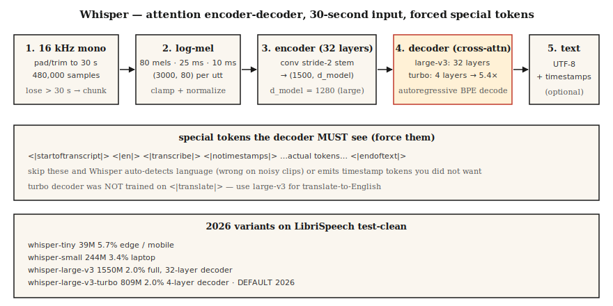

# Whisper — Architecture, Fine-Tuning, and the 2026 Turbo Era

> Whisper is an attention encoder-decoder trained on 680k hours of labeled audio. In 2026 it is still the default multilingual ASR model — but `large-v3-turbo` replaces `large-v3` almost everywhere, and the real production trick is VAD + chunking + forced language.

**Type:** Build
**Languages:** Python
**Prerequisites:** Phase 6 · 04 (ASR), Phase 7 · 05 (Full Transformer)
**Time:** ~75 minutes

## The Problem

You need a multilingual ASR that works on arbitrary internet audio — podcasts, YouTube clips, voice memos — without per-language engineering. Whisper is the answer. But "just use Whisper" hides four production decisions that every team gets wrong once:

1. Which Whisper? Tiny, base, small, medium, large-v2, large-v3, large-v3-turbo, or the closed `gpt-4o-transcribe`.
2. How do I feed long audio? Whisper's input window is exactly 30 seconds. Anything longer needs chunking.
3. How do I suppress hallucinations? Whisper generates "Thanks for watching!" on silence unless you gate with VAD.
4. Do I fine-tune, or prompt, or just stack a domain LM? 2026 Whisper fine-tuning is well-trodden; `transformers` + PEFT does it in 200 lines.

## The Concept



**Input pipeline.** Resample to 16 kHz mono. Pad / truncate to 30 seconds (480,000 samples). Log-mel with 80 mels, 25 ms window, 10 ms hop → `(3000, 80)` per utterance. Whisper's `log_mel_spectrogram` clamps and normalizes; do not substitute a naive log-mel or accuracy drops 3–5 WER points.

**Encoder.** Two 1D conv stem layers reduce time to 1500 frames, then 32 transformer encoder blocks. Output: `(1500, d_model)` hidden states. `large-v3` `d_model = 1280`, 20 heads, 32 layers. Multilingual: same encoder is used for 99 languages.

**Decoder.** 32 transformer decoder blocks (large-v2/v3) — cut to **4 layers** for `large-v3-turbo` (late 2024), which is the ~5.4× speedup everybody uses in 2026.

**Special tokens that actually matter.**
- `<|startoftranscript|>` — start of generation
- `<|en|>` / `<|es|>` / ... — language hint (force this when you know the language)
- `<|transcribe|>` or `<|translate|>` — task selector
- `<|notimestamps|>` — disable segment timestamps
- `<|0.00|>` … `<|30.00|>` — 1500 timestamp tokens in 20 ms bins, emitted inline

Whisper's decoder tokenizer is a custom BPE with ~51k tokens; all languages share the vocabulary.

**Models, params, WER on LibriSpeech test-clean (2026):**

| Model | Params | test-clean WER | Notes |
|-------|--------|----------------|-------|
| whisper-tiny | 39M | 5.7% | edge / mobile |
| whisper-small | 244M | 3.4% | laptop-tier |
| whisper-large-v3 | 1550M | 2.0% | 32-layer decoder |
| whisper-large-v3-turbo | 809M | 2.0% | 4-layer decoder, 5.4× faster |
| gpt-4o-transcribe | ? | ~1.4% | API only, not open |

`large-v3-turbo` drops translation-to-English capability (the decoder was trained on transcription only). Use `large-v3` for `<|translate|>`.

### What production teams actually do

1. Resample + VAD-gated chunking (Silero or WebRTC VAD) with 30 s windows.
2. Force `language="en"` (or wherever).
3. Force `condition_on_previous_text=False` for long streams to prevent drift loops.
4. `temperature=0.0`, fallback to `0.2, 0.4, 0.6` on low-confidence segments.
5. Optional: fine-tune on 10-100 hours of domain data via LoRA.

## Build It

### Step 1: the minimal Whisper frontend (log-mel)

```python
import numpy as np

SAMPLE_RATE = 16000
N_FFT = 400
HOP_LENGTH = 160
N_MELS = 80
CHUNK_LENGTH_S = 30
N_SAMPLES = CHUNK_LENGTH_S * SAMPLE_RATE
N_FRAMES = N_SAMPLES // HOP_LENGTH

def whisper_pad(audio):
    if len(audio) > N_SAMPLES:
        return audio[:N_SAMPLES]
    return np.pad(audio, (0, N_SAMPLES - len(audio)))
```

Whisper's reference implementation clamps log-mel to `[-1, 1]` after an exponentiated normalization. See the official `whisper/audio.py`.

### Step 2: inference in one line

```python
import whisper
model = whisper.load_model("large-v3-turbo")
result = model.transcribe(
    "clip.wav",
    language="en",
    task="transcribe",
    temperature=[0.0, 0.2, 0.4, 0.6],
    condition_on_previous_text=False,
    verbose=False,
)
print(result["text"])
```

### Step 3: VAD-gated long-form

Use `whisperx` or roll your own:

```python
import silero_vad
vad = silero_vad.load_silero_vad()

segments = silero_vad.get_speech_timestamps(audio, vad, sampling_rate=16000)
for s in segments:
    chunk = audio[s["start"]: s["end"]]
    text = model.transcribe(chunk, language="en")["text"]
    print(f"{s['start']/16000:.2f}s: {text}")
```

This is 80% of why production Whisper works. Silence frames no longer produce "Thank you for watching."

### Step 4: fine-tune with LoRA on 10 hours of domain audio

```python
from transformers import WhisperForConditionalGeneration, WhisperProcessor
from peft import LoraConfig, get_peft_model

processor = WhisperProcessor.from_pretrained("openai/whisper-large-v3-turbo")
model = WhisperForConditionalGeneration.from_pretrained("openai/whisper-large-v3-turbo")
model = get_peft_model(model, LoraConfig(
    r=32, lora_alpha=64,
    target_modules=["q_proj", "v_proj"], lora_dropout=0.05,
))

# Standard HF Trainer loop on a HuggingFace audio dataset.
```

On 10 hours of medical dictation, LoRA fine-tune drops WER from 12.5% → 4.8% in ~2 hours on one A100. Full fine-tune is overkill; LoRA at `r=32` is the 2026 default.

### Step 5: force-decode special tokens for language + task

```python
forced_ids = processor.get_decoder_prompt_ids(language="hi", task="transcribe")
output = model.generate(inputs.input_features, forced_decoder_ids=forced_ids)
```

Skipping this is the single most common Whisper bug — the model silently picks the wrong language on noisy clips.

## Use It

The 2026 playbook:

| Situation | Recipe |
|-----------|--------|
| English podcasts | large-v3-turbo + Silero VAD + `chunk_length_s=30` |
| Multilingual meeting | large-v3 + `language=<ISO>` forced |
| Real-time (&lt;1 s) | distil-whisper-large-v3 + streaming chunks |
| Mobile | whisper.cpp `ggml-tiny.en-q8_0.bin` (~75 MB) |
| Domain-specific terminology | LoRA fine-tune on 10-50 hours |
| Translate any → English | large-v3 with `task="translate"` (turbo does not do this) |

## Pitfalls that still ship in 2026

- **Hallucinations on silence.** `"Thanks for watching, don't forget to subscribe."` is a Whisper signature. Always VAD.
- **Language auto-detect drift.** Detected via 30 s probe that is wrong on noisy clips. Force language.
- **`condition_on_previous_text=True` drift loop.** In long transcripts, Whisper can get stuck on a topic and fabricate continuations. Turn it off past the first chunk.
- **Turbo used for translation.** `large-v3-turbo` is trained only for transcription; outputs garbage for `task="translate"`.
- **Overfit LoRA.** Fine-tuning on &lt;1 hour destroys multilingual capability. Start with 10+ hours per language.
- **Punctuation drift on long-form.** Whisper punctuates mid-sentence on chunk boundaries. Post-process with a sentence aligner.

## Ship It

Save as `outputs/skill-whisper-deployer.md`. Pick model variant, chunking, VAD, decoding params, and whether to LoRA-fine-tune for a given workload.

## Exercises

1. **Easy.** Run `code/main.py`. It fakes a `(3000, 80)` log-mel and walks through the Whisper-shaped encoder input stages. Print the resulting shapes.
2. **Medium.** Take a 5-minute podcast MP3, resample to 16 kHz mono, VAD-segment with Silero, transcribe each segment with `large-v3-turbo`, concatenate with timestamps. Report total WER against a human transcript.
3. **Hard.** LoRA fine-tune `whisper-small` on 1 hour of synthetic domain data (generate TTS with a fixed glossary of 20 terms). Measure WER pre vs post fine-tune on those terms specifically.

## Key Terms

| Term | What people say | What it actually means |
|------|-----------------|-----------------------|
| Turbo | Faster Whisper | Decoder cut to 4 layers (from 32); transcription-only. |
| Forced decoder ids | Language hint | Tokens prepended before generation to lock language + task. |
| Log-mel clamp | Whisper's trick | Normalize + clamp `(mel - filter_floor) / ref` into `[-1, 1]`. |
| `chunk_length_s` | Window | Must be 30 for Whisper — any other value breaks positional encoding. |
| condition_on_previous | Context carry | Feed previous segment's text as prefix; risky on long audio. |
| WhisperX | The realistic stack | Whisper + forced alignment + VAD + diarization. |

## Further Reading

- [Radford et al. (2022). Robust Speech Recognition via Large-Scale Weak Supervision](https://arxiv.org/abs/2212.04356) — the Whisper paper.
- [OpenAI — whisper repo](https://github.com/openai/whisper) — reference implementation, `audio.py` is the spec for log-mel.
- [OpenAI — large-v3-turbo discussion](https://github.com/openai/whisper/discussions/2363) — late-2024 turbo release notes.
- [Bain et al. (2023). WhisperX](https://arxiv.org/abs/2303.00747) — diarization + forced alignment wrapper.
- [Hugging Face — fine-tuning Whisper with PEFT](https://huggingface.co/blog/peft) — LoRA guide applies directly.
